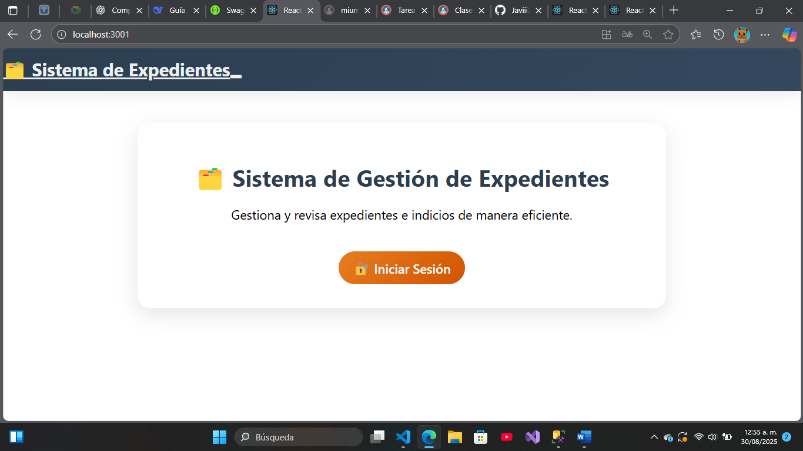
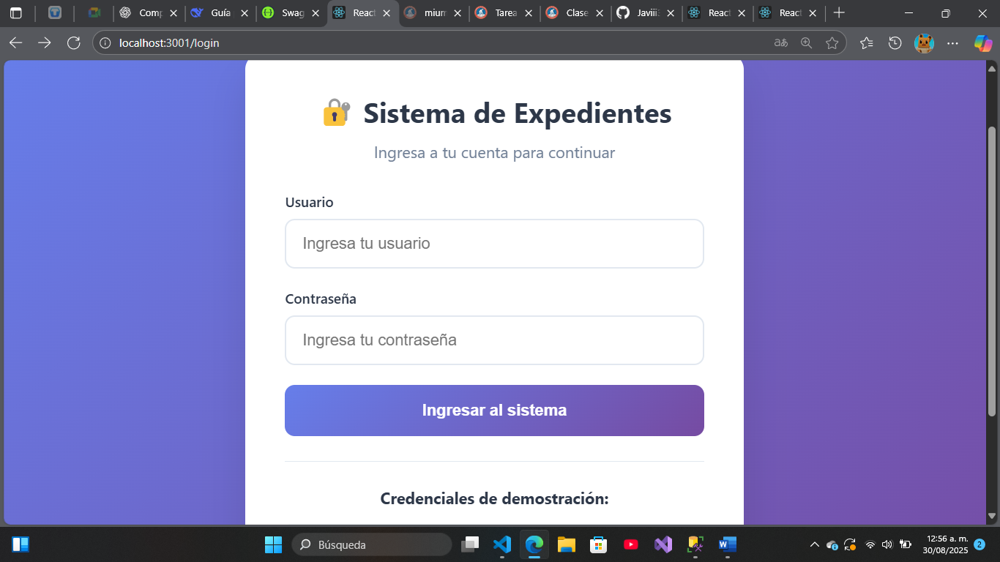

# Sistema de Gestión de Expedientes e Indicios - Full Stack

Sistema completo full-stack para la gestión de expedientes e indicios con autenticación JWT, roles de usuario y base de datos SQL Server.

##  Características Completas

###  Autenticación y Seguridad
- **JWT con roles** (Técnico/Coordinador)
- **BCrypt** para hash de contraseñas
- **Rutas protegidas** en frontend y backend
- **Validaciones** con Zod (frontend) y SQL constraints (backend)

###  Frontend Moderno (React + Vite + TypeScript)
- **Interfaz moderna** con gradientes y animaciones
- **Diseño completamente responsivo** 
- **Dashboard interactivo** según rol de usuario
- **Formularios** con React Hook Form + validación Zod
- **Navegación** con React Router v6

###  Backend Robust (Node.js + Express + SQL Server)
- **API RESTful** con TypeScript
- **Stored Procedures** optimizados en SQL Server
- **Documentación Swagger** interactiva
- **Manejo centralizado** de errores
- **Rate limiting** y seguridad con Helmet

##  Stack Tecnológico Completo

### Frontend
- **React 18** + TypeScript
- **Vite** - Build tool ultrarrápido
- **Bootstrap** + CSS personalizado
- **React Hook Form** + Zod validation
- **React Router v6** - Navegación
- **Context API** - Gestión de estado

### Backend  
- **Node.js** + Express + TypeScript
- **SQL Server** + Stored Procedures
- **JWT** + bcrypt - Autenticación
- **Zod** - Validaciones
- **Swagger** - Documentación
- **Helmet** + CORS - Seguridad

##  Instalación Completa

### 1. Clonar el repositorio
```bash
git clone https://github.com/Javiii3er/mi-api-expedientes.git
cd mi-api-expedientes
```

### 2. Backend - Configuración e instalación
```bash
# Instalar dependencias del backend
npm install

# Configurar variables de entorno
cp .env.example .env
# Editar .env con tus credenciales de SQL Server

# Configurar base de datos (ejecutar en SSMS):
# 1. scripts/schema.sql
# 2. scripts/seed.sql

# Ejecutar backend
npm run dev
```

### 3. Frontend - Configuración e instalación  
```bash
cd frontend

# Instalar dependencias del frontend
npm install

# Configurar variables de entorno
cp .env
# Editar .env: VITE_API_BASE_URL=http://localhost:3000

# Ejecutar frontend
npm run dev
```

##  URLs de la Aplicación

- **Frontend:** http://localhost:3001
- **Backend API:** http://localhost:3000  
- **Documentación Swagger:** http://localhost:3000/docs
- **Health Check:** http://localhost:3000/health

## Credenciales de Demo

**Técnico:**
- Usuario: `tecnico1`
- Contraseña: `password123`
- **Permisos:** Gestionar expedientes e indicios

**Coordinador:**
- Usuario: `coord1`
- Contraseña: `password123`
- **Permisos:** Revisar y aprobar expedientes

## 🎯 Flujo Principal de la Aplicación

1. **Login** - Autenticación con JWT
2. **Dashboard** - Vista principal según rol
3. **Expedientes** - CRUD completo de expedientes
4. **Indicios** - Gestión de indicios por expediente
5. **Revisión** - Aprobar/rechazar expedientes (solo coordinadores)

##  Estructura del Proyecto

```
mi-api-expedientes/
├── backend/                 # API Server
│   ├── src/
│   │   ├── controllers/     # Lógica de negocio
│   │   ├── routes/         # Rutas API
│   │   ├── db/            # Base de datos
│   │   ├── auth/          # Autenticación
│   │   └── middlewares/   # Middlewares
│   ├── scripts/           # SQL scripts
│   └── package.json
│
├── frontend/                # React Application
│   ├── src/
│   │   ├── components/     # Componentes reutilizables
│   │   ├── pages/         # Páginas de la app
│   │   ├── services/      # Servicios API
│   │   ├── auth/          # Autenticación frontend
│   │   ├── types/         # TypeScript definitions
│   │   └── styles/        # Estilos CSS
│   ├── package.json
│   └── vite.config.ts
│
├── .env            # Variables de entorno
└── README.md              # Esta documentación
```

##  Scripts Disponibles

### Backend
```bash
npm run dev      # Desarrollo con hot-reload
npm run build    # Compilar TypeScript  
npm run start    # Producción
npm run lint     # Linting
npm run format   # Formateo de código
```

### Frontend
```bash
npm run dev      # Modo desarrollo
npm run build    # Build para producción
npm run preview  # Preview del build
npm run test     # Ejecutar tests
```

## 🗄️ Base de Datos

### Tablas Principales
- **Usuarios** - Usuarios del sistema con roles
- **Expedientes** - Expedientes con estados (pendiente/aprobado/rechazado)
- **Indicios** - Indicios asociados a expedientes

### Stored Procedures Implementados
- `sp_Usuarios_Login` - Autenticación de usuarios
- `sp_Expedientes_Listar` - Listado con paginación
- `sp_Expedientes_Crear` - Creación de expedientes
- `sp_Indicios_Crear` - Creación de indicios
- **+8 procedimientos** más para gestión completa

## 🔧 Variables de Entorno

### Backend (.env)
```env
NODE_ENV=development
PORT=3000
DB_SERVER=localhost\SQLEXPRESS
DB_NAME=ExpedientesDB
DB_USER=sa
DB_PASSWORD=TuPassword
JWT_SECRET=clave_super_secreta_jwt
JWT_EXPIRES_IN=1d
```

### Frontend (.env)
```env
VITE_API_BASE_URL=http://localhost:3001
```

##  Despliegue

### Backend (Producción)
```bash
npm run build
npm start
```

### Frontend (Producción)
```bash
npm run build
# Servir archivos de /dist con Nginx, Apache, Vercel, Netlify, etc.
```

## Soporte y Troubleshooting

### Problemas Comunes
1. **Error de conexión a BD:** Verificar credenciales en .env
2. **CORS issues:** Asegurar que backend tenga CORS configurado
3. **Login falla:** Verificar que usuarios seed tengan hashes bcrypt válidos

### Logs de Debug
- **Backend:** Los logs se muestran en la terminal
- **Frontend:** Ver consola del navegador (F12)

##  Capturas del Sistema

![Login Moderno]
![Dashboard] 


##  Licencia

Este proyecto está bajo la Licencia MIT. Ver [LICENSE](LICENSE) para más detalles.

## 👨‍💻 Autor

**Javier Rivera**  
- 📧 Email: joselurip1031@gmail.com  
- 🐙 GitHub: [Javiii3er](https://github.com/Javiii3er)


---

**¡Proyecto desarrollado con 😾❤️ usando TypeScript, React, Node.js y SQL Server!**